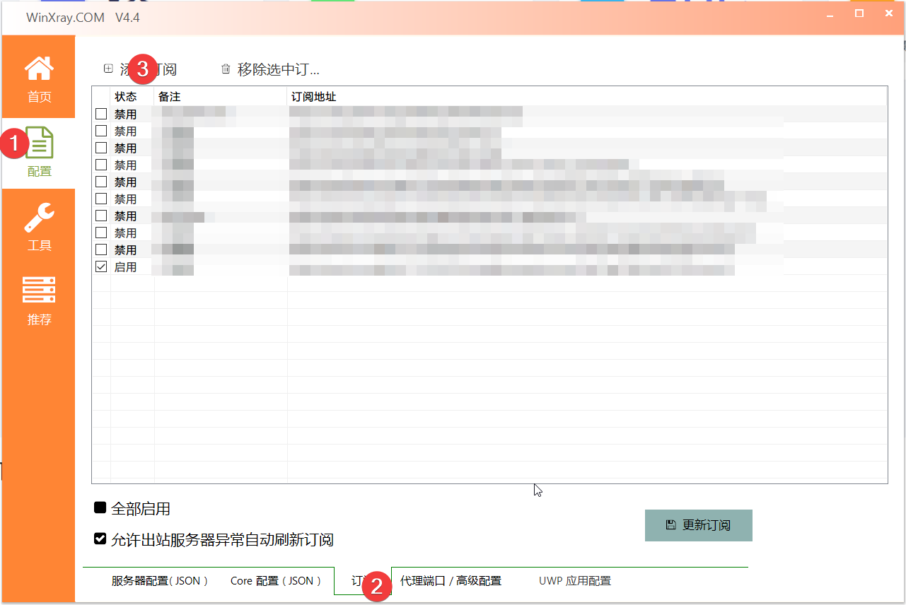
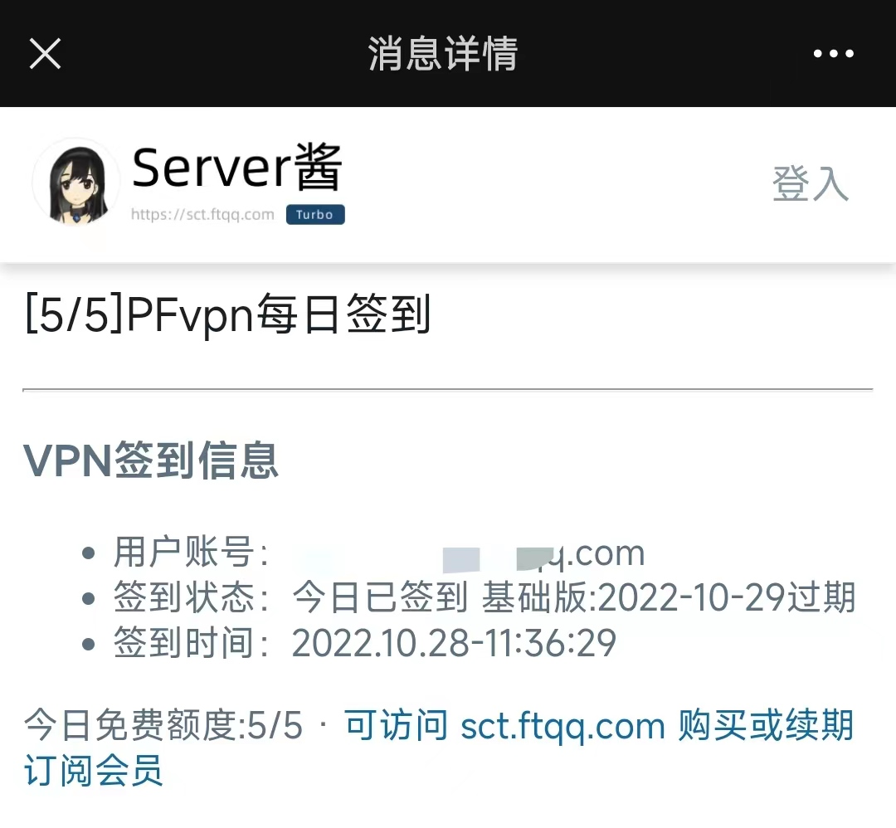

# PFvpn-Sign

[PFvpn](https://purefast.net/)每日签到脚本，2022/11/17之后已不可用，等待更新...

## TopNews

2022/11/15：不支持多账户签到，请使用单一账户

2022/11/17: 由于官网还在不停更新，暂时不维护了，等稳定下来再解决。**【注意】**

## 介绍

PFvpn提供了全球网络中继服务，免费版需要每日签到以获取会员天数和流量，国内网速达15Mbps

注册链接：https://purefast.net/auth/register?code=OeJl

## 使用

## 软件使用方式

通过注册[链接](https://purefast.net/auth/register?code=OeJl)进行注册，点击以下按钮复制订阅链接


下载软件[Winxray](https://github.com/TheMRLL/WinXray.git)，具体使用方式参见其说明文件，将订阅链接拷贝进去更新订阅即可



### 签到脚本使用方式

#### 步骤

1、克隆仓库

```
$git  clone https://github.com/yunke120/pfvpn-sign.git -b re
```

2、安装依赖

```
$pip install -r requirements.txt
```

3、修改`user.json`（将`user_sample.json`拷贝并重命名）

| 属性     | 值                                                           |
| -------- | ------------------------------------------------------------ |
| username | 用户邮箱                                                     |
| password | 用户密码                                                     |
| key      | [Server酱](https://sct.ftqq.com/)密钥或[息知](https://xz.qqoq.net/#/index)密钥 |

支持多用户，示例

```json
[
    {
        "username":"example1@163.com",
        "password":"12345678",
        "key":"SCT*****"
    },
    {
        "username":"example2@qq.com",
        "password":"1234567890",
        "key":"XZ*****"
    }
]
```


4、运行

```
$python main.py
```

5、运行结果截图



## 部署

### 服务器

打开文件`crontab`

```
$vi /etc/crontab
```

添加以下代码，需确认有python3环境，`main.py`改为绝对路径

```
0 0 3 * * *  python3 main.py
```

也可以通过宝塔面板安装Python项目管理器进行部署。

## GitHub Actions

1. fork项目到自己的账户中

2. 在`Setting->Secrets->Actions->New respository secret`中添加自己的账户

   | 序号 | 名称  | 值                                                           |
   | ---- | ----- | ------------------------------------------------------------ |
   | 1    | USERS | 邮箱名，多用户通过&隔开                                      |
   | 2    | PWD   | 密码，多用户通过&隔开                                        |
   | 3    | KEY   | [Server酱](https://sct.ftqq.com/)密钥或[息知](https://xz.qqoq.net/#/index)密钥，多用户通过&隔开 |

   多用户示例：`example1@163.com&wxample2@qq.com`

3. 点击进入`Actions`，启用此仓库的工作流

4. 选择`PFvpn Sign`，点击`Enable workflow`启用

5. 点击`Run workflow->Run workflow`立刻运行，稍等几秒查看工作流是否开始正常运行

## 参考

1. [WinXray](https://github.com/TheMRLL/WinXray)
2. [PFvpn](https://purefast.net/)

